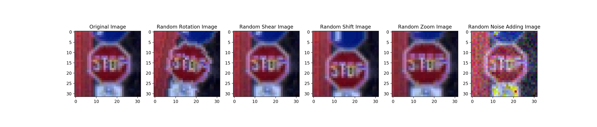

# **Traffic Sign Recognition** 

Pongrut Palarpong  
March 29, 2018

---

**Build a Traffic Sign Recognition Project**

The goals / steps of this project are the following:
* Load the data set (see below for links to the project data set)
* Explore, summarize and visualize the data set
* Design, train and test a model architecture
* Use the model to make predictions on new images
* Analyze the softmax probabilities of the new images
* Summarize the results with a written report

[//]: # (Image References)

[image1]: ./examples/visualization.jpg "Visualization"
[image2]: ./examples/grayscale.jpg "Grayscaling"
[image3]: ./examples/random_noise.jpg "Random Noise"
[image4]: ./examples/placeholder.png "Traffic Sign 1"
[image5]: ./examples/placeholder.png "Traffic Sign 2"
[image6]: ./examples/placeholder.png "Traffic Sign 3"
[image7]: ./examples/placeholder.png "Traffic Sign 4"
[image8]: ./examples/placeholder.png "Traffic Sign 5"

## Rubric Points
### Here I will consider the [rubric points](https://review.udacity.com/#!/rubrics/481/view) individually and describe how I addressed each point in my implementation.  

---
### Writeup / README

#### 1. Provide a Writeup / README that includes all the rubric points and how you addressed each one. You can submit your writeup as markdown or pdf. You can use this template as a guide for writing the report. The submission includes the project code.

You're reading it! and here is a link to my [project code](https://github.com/udacity/CarND-Traffic-Sign-Classifier-Project/blob/master/Traffic_Sign_Classifier.ipynb)

### Data Set Summary & Exploration

#### 1. Provide a basic summary of the data set. In the code, the analysis should be done using python, numpy and/or pandas methods rather than hardcoding results manually.

I use numpy to store all training, testing, validation datasets and their labels then uses pandas in retrieving the names of all 43 classes from the csv file, the summary statistics of the traffic
signs data set:

* The size of training set is 34,799
* The size of the validation set is 4,410
* The size of test set is 12,630
* The shape of a traffic sign image is (32, 32, 3)
* The number of unique classes/labels in the data set is 43

#### 2. Include an exploratory visualization of the dataset.

Here is an exploratory visualization of the data set. 

The following are bar chart showing how the data distributed in each dataset.

### Design and Test a Model Architecture

#### 1. Describe how you preprocessed the image data. What techniques were chosen and why did you choose these techniques? Consider including images showing the output of each preprocessing technique. Pre-processing refers to techniques such as converting to grayscale, normalization, etc. (OPTIONAL: As described in the "Stand Out Suggestions" part of the rubric, if you generated additional data for training, describe why you decided to generate additional data, how you generated the data, and provide example images of the additional data. Then describe the characteristics of the augmented training set like number of images in the set, number of images for each class, etc.)

To do image preprocessing I decided to do 2-steps process that will first resize the image to 32x32 pixels to match the input size requirement of the network. Then use the OpenCV library to normalize the numpy array to the range between 0 and 1 because this make image has more balance between dark and light pixel.
Here is an example of a traffic sign image before and after preprocessing.

To add more data to the the data set, I used the following techniques; random rotation, shear, shift, zoom, and noise adding because makes model robust to recognize variety new sign images.
Here is an example of an original image and an augmented image:

The difference between the original data set and the augmented data set is the following.
- Random rotation: the original image is ramdomly rolated.
- Random shear: the original image is randomly spatial sheared.
- Random shift: the original image is randomly shifted.
- Random zoom: the original image is randomly zoomed.
- Random noise adding: the original image is randomly adding noise.

#### 2. Describe what your final model architecture looks like including model type, layers, layer sizes, connectivity, etc.) Consider including a diagram and/or table describing the final model.

My final model consisted of the following layers:

| Layer         		|     Description	        					| 
|:---------------------:|:---------------------------------------------:| 
| Input         		| 32x32x3 RGB image   							| 
| Convolution 5x5     	| 1x1 stride, valid padding, outputs 28x28x6 	|
| RELU					|outputs 28x28x6|
| Max pooling	      	| 2x2 stride,  outputs 14x14x6 				|
| Convolution 5x5	    | 1x1 stride, valid padding, outputs 10x10x16 	|
| RELU					|10x10x16|
| Max pooling	      	| 2x2 stride,  outputs 5x5x16 				|
| Flatten		| outputs 400       									|
| Fully connected		| outputs 120	|
| RELU					|outputs 120|
| Dropout					|outputs 120|
| Fully connected		| outputs 84	|
| RELU					| outputs 84	|
| Dropout					| outputs 84	|
| Fully connected		| outputs 43	|									|
| Softmax				| outputs 43	|
|						|												|
|						|												|
 

#### 3. Describe how you trained your model. The discussion can include the type of optimizer, the batch size, number of epochs and any hyperparameters such as learning rate. 

To train the model, I used the LeNet architecture consists of two sets of convolutional, activation, and pooling layers, followed by a fully-connected layer, activation, another fully-connected, and finally a softmax classifier. 

The AdamOptimizer is the optimization function for the network. Training has been designed to make the model robust to the new input image, but since the training data only has the sign object, it is just a straight view image with a similar sign size. This lead to overfitting problem to avoid this problem, I set keep drop out at 0.5 to make the model not converge too soon, which will result in setting up epoch at 100 epochs to get 0.953 validation accuracy at 86 epoch with 512 batch size. 
Moreover, I have performed image augmentation for five methods in every batch before running through the network. Therefore, the batch size increases to 3,072 images per batch.

My final model results were:
* training set accuracy of 0.998
* validation set accuracy of 0.953
* test set accuracy of 0.944

If an iterative approach was chosen:
* What was the first architecture that was tried and why was it chosen?

I chose LeNet architecture because It is a simple convolutional neural network with only 60 thousand parameters. Thus, it will take less computational power for the simple classification problem.
* What were some problems with the initial architecture?

The original LeNet poorly performed for classifying new images.
* How was the architecture adjusted and why was it adjusted? Typical adjustments could include choosing a different model architecture, adding or taking away layers (pooling, dropout, convolution, etc), using an activation function or changing the activation function. One common justification for adjusting an architecture would be due to overfitting or underfitting. A high accuracy on the training set but low accuracy on the validation set indicates over fitting; a low accuracy on both sets indicates under fitting.

I added a dropout layer to 1st and 2nd fully connected layers and also added an image augmentation before sending the input to the network.
* Which parameters were tuned? How were they adjusted and why?

In the final model, I changed keep drop-out value from 0.75 to 0.50 and epoch from 50 to 100 epoch.
To reduce drop-out value is prevent overfitting problem and to meet accuracy requirement it needs more epochs to train.
* What are some of the important design choices and why were they chosen? For example, why might a convolution layer work well with this problem? How might a dropout layer help with creating a successful model?

The LeNet is a convolutional neural network, the Convolutional Neural Network (CNN) architecture is suitable for image classification because the image is indeed 2D width and height which CNN can efficiently do convolution operation by sweeping the relationship between each part of the image and creating great filters . This convolution operation makes it easy for CNN to detect objects in multiple locations, difference lightings, or even just some part of objects in an image. With dropout, some neurons randomly removed and this causes the network not to rely on some of the neuron too much, which may result in overfitting problem.
 
 

### Test a Model on New Images

#### 1. Choose five German traffic signs found on the web and provide them in the report. For each image, discuss what quality or qualities might be difficult to classify.

Here are fifteen German traffic signs that I found on the web:

#### 2. Discuss the model's predictions on these new traffic signs and compare the results to predicting on the test set. At a minimum, discuss what the predictions were, the accuracy on these new predictions, and compare the accuracy to the accuracy on the test set (OPTIONAL: Discuss the results in more detail as described in the "Stand Out Suggestions" part of the rubric).

Here are the results of the prediction:

| Image			        |     Prediction	        					| 
|:---------------------|:---------------------------------------------| 
| 1 Speed limit (30km/h)      		| 1 Speed limit (30km/h)   									| 
| 12 Priority road     			| 12 Priority road 										|
| 14 Stop					| 14 Stop											|
| 17 No entry	      		| 17 No entry					 				|
| 18 General caution			| 18 General caution      							|
| 23 Slippery road      		| 23 Slippery road   									| 
| 25 Road work     			| 25 Road work 										|
| 28 Children crossing					| 31 Wild animals crossing											|
| 33 Turn right ahead	      		| 33 Turn right ahead					 				|
| 34 Turn left ahead			| 34 Turn left ahead      							|
| 35 Ahead only      		| 35 Ahead only   									| 
| 36 Go straight or right     			| 36 Go straight or right 										|
| 4 Speed limit (70km/h)					| 1 Speed limit (30km/h)											|
| 5 Speed limit (80km/h)	      		| 13 Yield					 				|
| 7 Speed limit (100km/h)			| 7 Speed limit (100km/h)      							|

The model was able to correctly guess 12 of the 15 traffic signs, which gives an accuracy of 80%. This compares favorably to the accuracy on the test set of 94.4%

Three images from the 15 images misclassified. The first image was a Children crossing sign, where the class ID was 28. The high probability that misclassifies caused by the number of data sign classes 28 in the training dataset was tiny compared to other types.
The second image is speed limit (30km / h), and the third speed limit (100km / h) are both images that were not taken from the front view, which the model has not previously been trained with. For misclassify, this problem may be reduced in the future if a random perspective function is added to the augment_data function.

#### 3. Describe how certain the model is when predicting on each of the five new images by looking at the softmax probabilities for each prediction. Provide the top 5 softmax probabilities for each image along with the sign type of each probability. (OPTIONAL: as described in the "Stand Out Suggestions" part of the rubric, visualizations can also be provided such as bar charts)

The code for making predictions on my final model is located in the 18th cell of the Ipython notebook.
The prediction result for 15 new images:

| Probability         	|     Prediction	        					| Remark|
|---------------------:|:---------------------------------------------:| :---------------------------------------------| 
| .9987         			| 1 Speed limit (30km/h)   									| 			|
| .9997     				| Priority road 										|			|
| 1.0000					| Stop											|			|
| .6546	      			| 17 No entry					 				|			|
| 1.0000				    | 18 General caution      							|			|
| .7108				    | 23 Slippery road      							|			|
| .9983				    | Road work      							|			|
| .9160				    | 31 Wild animals crossing      							| .1653 predicted as 28 Children crossing (True Label)    							|
| .9749				    | 33 Turn right ahead	      							|
| .9980				    | 34 Turn left ahead      							|
| .8762			    | 35 Ahead only      							|
| .9909				    | 36 Go straight or right      							|
| .7284				    | 1 Speed limit (30km/h)	      							| .1541 4 Speed limit (70km/h) (True Label) |
| .9963			    | 5 Speed limit (80km/h)      							| 0.0 13 Yield	(True Label) |
| .3812			    | Speed limit (100km/h)	      							|  |

### (Optional) Visualizing the Neural Network (See Step 4 of the Ipython notebook for more details)
#### 1. Discuss the visual output of your trained network's feature maps. What characteristics did the neural network use to make classifications?

